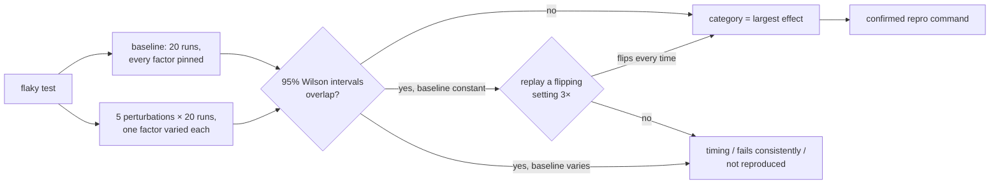

# NullCase

[](https://github.com/Rowan-gne/NullCase/actions/workflows/ci.yml)

[](LICENSE)

**Finds out *why* a flaky pytest test is flaky, by controlled experiment.**

Most flaky-test tools stop at "this test sometimes fails." NullCase re-runs the
test under controlled conditions, changing one factor at a time: test order,
hash seed, network access, timezone and parallelism. It then uses a
statistical test to decide which factor changes the failure rate, and prints a
command that reproduces the failure on demand.

```text
$ nullcase-battery --project eval/demo-repo tests/test_order.py::test_first_user_gets_id_1

              runs  fails   rate  95% Wilson CI
baseline        20      0   0.00  [0.00, 0.16]
order           20     16   0.80  [0.58, 0.92]  differs from baseline
hash_seed       20      0   0.00  [0.00, 0.16]
network_off     20      0   0.00  [0.00, 0.16]
timezone        20      0   0.00  [0.00, 0.16]
parallel        20      0   0.00  [0.00, 0.16]

diagnosis: order_dependent (wilson interval)
repro (--randomly-seed=3626764237, failed 3/3 replays):
  cd eval/demo-repo && PYTHONHASHSEED=0 TZ=UTC python -m pytest -p no:cacheprovider -q --randomly-seed=3626764237 tests/test_order.py
```

*Real output from this repository. Only the absolute paths in the last line
are shortened.*

> **Status: early-stage.** This repo holds the public, open-source components,
> and all of them run locally. The hosted service (API, GitHub App, dashboard,
> billing) is designed in [docs/technical-guide.md](docs/technical-guide.md) but
> **not deployed**. Version 0.1.0 is prepared but not yet published to PyPI.

## Local metrics

Measured on 2026-09-24 on an Apple M3 laptop (macOS 14.6, Python 3.12.7) unless
stated otherwise. Every number can be reproduced with the commands in
[Reproduce the numbers](#reproduce-the-numbers).

| Metric | Result |
|---|---|
| Test suite | **60 tests, all passing in 3 of 3 consecutive runs** (30.4 s, 31.1 s, 30.4 s) |
| Branch coverage | **85%** overall, including code the tests run in child processes. Plugin 100%, retrieval 96–100%, battery core 91–100%. The two CLI front-ends are the gap (35% and 0%). |
| Property-based tests | 11 [Hypothesis](https://hypothesis.readthedocs.io/) properties covering the statistics and diagnosis rules |
| Type checking | pyright **strict** mode, 0 errors |
| CI (GitHub Actions) | Green on the last 3 pushes to `main`, 45–66 s per run (lint, format, type check, tests) |
| Diagnosis eval | **6 of 6** seeded flaky tests diagnosed correctly, in 3 of 3 full runs (first version: 5 of 6; see [Eval results](#eval-results)) |
| Full eval run time | 204 s for all six tests (120 isolated pytest runs per test, plus confirmation replays) |
| One battery run | about 31 s for one test at default settings (20 baseline runs plus 20 runs for each of 5 perturbations) |
| Code size | about 930 lines of product code, 570 lines of tests (non-blank, non-comment) |

## How it works



| Perturbation | How | Catches |
|---|---|---|
| Test order | `pytest-randomly` with spread-out seeds | shared state between tests |
| Hash seed | varied `PYTHONHASHSEED` | code that relies on `set`/`dict` iteration order |
| Network off | `pytest-socket --disable-socket` | hidden network calls |
| Timezone | `TZ` set to UTC+14, UTC+12, UTC−12 and UTC−11 | "today" and date-boundary bugs |
| Parallel | `pytest-xdist -n 4` | shared files and ports under concurrency |

Every run is a fresh `pytest` subprocess. Results are read back through
NullCase's own pytest plugin, so the tool uses its own plugin to collect its
data.

## Engineering highlights

- **Statistics instead of guesswork.** A factor counts only when its 95%
  [Wilson score interval](https://en.wikipedia.org/wiki/Binomial_proportion_confidence_interval#Wilson_score_interval)
  doesn't overlap the baseline's. Hypothesis properties check the interval math
  (bounds, symmetry, narrowing with more runs) and the diagnosis rule.
- **Found and fixed a hidden sampling bias.** Consecutive `--randomly-seed`
  values produced nearly identical test orders: a test that should fail about
  75% of the time failed only 2 of 10 times. The cause is that pytest-randomly
  orders tests by `crc32(seed::nodeid)`, and CRC32 is linear. The battery now
  draws widely spread seeds from a fixed generator, so orders are close to
  independent and results stay reproducible.
- **An honest evaluation, including a miss.** The first version scored 5 of 6
  and the miss was documented rather than hidden. The fix is kept separate from
  the statistical rule, and the README says plainly that the resulting 6/6 is
  not independent evidence.
- **A repro command only when it's confirmed.** A repro is printed only after
  the failing setting has been replayed and failed 3 of 3 times.
- **Static analysis with `ast`.** Retrieval builds a repository import graph,
  resolving relative imports, to find existing tests that are good style
  examples for a module.
- **Release engineering.** A tag-triggered release workflow checks that every
  version matches, runs the tests, builds, runs `twine check --strict`, and is
  set up to publish through PyPI Trusted Publishing, so no API tokens are
  stored. It hasn't run yet because nothing has been tagged. Clean builds were
  installed in a fresh virtualenv, which caught a real CLI argument-parsing bug
  before release.

## Components

| Component | What it does | Not built yet |
|---|---|---|
| [pytest plugin](packages/pytest-plugin) | Writes one JSON Lines record per test (outcome, duration, file path, node ID), and works under pytest-xdist | upload to a backend, quarantine list (both stubs) |
| [Experiment battery](sandbox) | The perturbations, diagnosis and repro commands; a single-test line-coverage check (`nullcase-coverage`); Dockerfile | running on remote sandbox VMs |
| [Eval harness](eval) | Six seeded flaky tests, one per category, and a harness that scores the battery against their labels | an external, published flaky-test dataset |
| [Retrieval](packages/retrieval) | Import-graph search for example tests, ranked by name and path similarity | embedding-based fallback (stub) |
| [Upload action](packages/upload-action) | Composite GitHub Action that runs pytest with the plugin; linted with actionlint | the upload itself (stub); not yet run on a real Actions runner |

The hosted pieces (FastAPI backend, Postgres, GitHub App, AI-written fixes and
billing) are designed in the [technical guide](docs/technical-guide.md) and not
built in this repository.

## Quickstart

Requires Python 3.11+ and [uv](https://docs.astral.sh/uv/). Docker is optional.

```bash
git clone https://github.com/Rowan-gne/NullCase.git && cd NullCase
uv sync
uv run nullcase-battery --project eval/demo-repo tests/test_order.py::test_first_user_gets_id_1
```

To run the battery on your own project:
`uv run nullcase-battery --project path/to/project tests/test_x.py::test_y`.
The node ID must be relative to that project's pytest rootdir. For options and
Docker usage, see [sandbox/README.md](sandbox/README.md).

## Reproduce the numbers

```bash
uv run pytest                                  # test suite
uv run coverage run -m pytest && uv run coverage combine && uv run coverage report
uv run pyright                                 # strict type check
uv run python eval/harness/run_eval.py         # diagnosis eval, about 3–4 minutes
```

The eval's network test makes a real HTTP request, so it needs internet
access. Timings depend on the machine.

## Eval results

**6 of 6 seeded tests diagnosed correctly** in each of three full runs on
2026-09-24 (20 baseline runs, 20 runs per perturbation).

| Seeded test | Label | Predicted | Decided by | Repro printed |
|---|---|---|---|---|
| `test_first_user_gets_id_1` | order_dependent | order_dependent | Wilson interval | yes |
| `test_unique_tags_keeps_first_seen_order` | hash_order | hash_order | deterministic flip | yes (the pinned baseline command) |
| `test_example_dot_com_is_up` | network | network | Wilson interval | yes |
| `test_invoice_is_dated_today` | timezone | timezone | Wilson interval | yes |
| `test_export_report[acme]` | concurrency | concurrency | Wilson interval | no (not deterministic) |
| `test_cache_warmup_finishes_quickly` | timing | timing | baseline only | no (not deterministic) |

**This score is not independent of the method.** The first version of the
battery scored **5 of 6** (two runs, same settings). It missed the
hash-order test and reported `fails_consistently`: with the baseline pinned
at `PYTHONHASHSEED=0` the test failed 20/20, varying the seed brought it to
15/20, and the two 95% Wilson intervals overlap ([0.84, 1.00] vs
[0.53, 0.89]). The deterministic-flip check (see
[sandbox/README.md](sandbox/README.md)) was then added specifically to handle
that pattern: replaying `PYTHONHASHSEED=1` passed every time while the pinned
seed failed every time. Because the fix was designed after seeing the miss,
6/6 shows the fix works on the case it targets. It isn't fresh evidence of
accuracy. The other five tests are still decided exactly as before.

**Limits of this number:** six hand-written tests, one per category, labelled
by the same author who wrote the battery. It checks that each perturbation
works end to end. It is not a measure of accuracy on real-world flaky tests.
The timezone result depends on the time of day the harness runs.

## Further reading

- [docs/technical-guide.md](docs/technical-guide.md): full architecture, data
  model, and design decisions for the complete product. Its §6.2 file layout
  describes an earlier single-repo plan and doesn't match this repository.
- [CHANGELOG.md](CHANGELOG.md) and [RELEASING.md](RELEASING.md): the 0.1.0
  release plan.

## License

[MIT](LICENSE)
