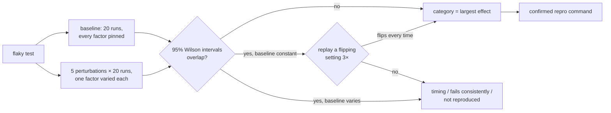

# NullCase

[](https://github.com/Rowan-gne/NullCase/actions/workflows/ci.yml)

[](LICENSE)
[](https://youtu.be/o39lXgtWzXU)

**Finds out *why* a flaky pytest test is flaky, by controlled experiment.**

<p align="center">
  
</p>

See it run in GitHub Actions on a seeded incident: [Rowan-gne/nullcase-demo](https://github.com/Rowan-gne/nullcase-demo).

<p align="center">
  
</p>

Most flaky-test tools stop at "this test sometimes fails." NullCase re-runs the
test under controlled conditions, changing one factor at a time: test order,
hash seed, network access, timezone and parallelism. It then uses a
statistical test to decide which factor changes the failure rate, and prints a
command that reproduces the failure on demand.

```text
$ nullcase-battery --project eval/demo-repo tests/test_order.py::test_first_user_gets_id_1

              runs  fails   rate  95% Wilson CI
baseline        20      0   0.00  [0.00, 0.16]
order           20     16   0.80  [0.58, 0.92]  differs from baseline
hash_seed       20      0   0.00  [0.00, 0.16]
network_off     20      0   0.00  [0.00, 0.16]
timezone        20      0   0.00  [0.00, 0.16]
parallel        20      0   0.00  [0.00, 0.16]

diagnosis: order_dependent (wilson interval)
repro (--randomly-seed=3626764237, failed 3/3 replays):
  cd eval/demo-repo && PYTHONHASHSEED=0 TZ=UTC \
    python -m pytest -p no:cacheprovider -q \
    --randomly-seed=3626764237 tests/test_order.py
```

*Real output from this repository. Absolute paths in the repro command are
shortened, and the command is wrapped to fit narrow screens.*

> **Status: early-stage.** This repo holds NullCase's open-source components,
> and all of them run locally. A hosted service is in private development.
> Version 0.1.0 is prepared but not yet published to PyPI or the GitHub
> Marketplace.

## Where the AI comes in

Everything in this repository is measurement. The plugin records every test
result, and the battery re-runs a test under controlled conditions and uses
statistics to say why it fails.

NullCase's private service adds one step on top: it asks a model (Claude) for
a patch. It then re-runs the same experiments on the patched code, and
accepts the patch only if they now pass every time. The model never judges
its own patch.

Here is one recorded run of the whole loop, on a flaky test added to the demo
repository on 2026-09-29:

<p align="center">
  
</p>

Later the same day, a second live call was made separately on the same test.
It produced exactly the same patch ($0.0111), which passed the gate the same
way, and it's open as draft PR
[#6](https://github.com/Rowan-gne/nullcase-demo/pull/6). In CI, NullCase's
Action also diagnoses the test as `order_dependent`
([run](https://github.com/Rowan-gne/nullcase-demo/actions/runs/36517093002)).

### Why combine measurement with a model

| | Flaky-test detector | A coding agent on its own (e.g. Claude Code) | NullCase |
|---|---|---|---|
| Finds flaky tests | Yes, from re-runs or CI history | Only if told which test | Yes, from repeated runs |
| Says *why* it's flaky | No | A guess from reading the code | Measured: one factor changed at a time |
| Writes a fix | No; usually quarantines or retries | Yes | Yes, the model's only job |
| Proves the fix works | Nothing to prove | Its own judgement, or a few re-runs | The same experiments, re-run until they pass every time |

Each half covers what the other can't:

- **Detection alone stops at "this test sometimes fails."** Retrying or
  quarantining hides the failure but leaves the bug in place.
- **A model alone is guessing about something it can't see.** A flaky test
  usually passes, so a few re-runs after a change prove little. The quickest
  ways to turn a test green (a skip, a retry, a looser assertion, a longer
  sleep) are exactly the wrong fixes.
- **Measurement gives the model a narrow question.** Instead of "why is this
  flaky?", it gets "this fails only when test order changes; here's a seed
  that reproduces it, and the code involved." In the run above it answered
  with one fixture on the first attempt, for about a cent.
- **Measurement also decides the answer, so the model never marks its own
  work.** In the seeded-tests run below, the gate turned down two timezone
  patches before accepting a third:
  - one edited the assertion;
  - one broke a healthy test elsewhere.

  In the gate's own check, it rejected all 9 hand-written cheat patches
  (skips, weakened or swallowed assertions, config edits and a no-op).
- **Only the fix step costs model tokens.** Detection and diagnosis are plain
  test runs. Nothing is sent to a model when no flaky test is found.

This hasn't been benchmarked against other tools. The comparison describes
what each approach can know, not measured scores.

### Across the demo's seeded tests

On 2026-09-28, `claude-sonnet-5-5` got one live run on each seeded flaky test
in the demo repository.

- **Fixed:** all 5 tests NullCase diagnosed as fixable (order, hash order,
  timezone, concurrency and timing), 4 of them on the first attempt, for
  $0.061 in total.
- **Not attempted:** the network test fails every run because the sandbox is
  offline, so NullCase classified it as broken.
- **Flagged:** the timezone fix. After the gate rejected an edited assertion,
  the model kept the assertion and made the test's `date.today()` return the
  UTC date instead. The result is correct, but it gets around the rule, so a
  human should review it.

The same author wrote these tests and NullCase, so this shows the fix loop
working on known kinds of flakiness, not a success rate on real projects.

Each fix is open as a draft PR in the demo repository:
[#1](https://github.com/Rowan-gne/nullcase-demo/pull/1) order,
[#2](https://github.com/Rowan-gne/nullcase-demo/pull/2) hash order,
[#3](https://github.com/Rowan-gne/nullcase-demo/pull/3) timezone,
[#4](https://github.com/Rowan-gne/nullcase-demo/pull/4) concurrency and
[#5](https://github.com/Rowan-gne/nullcase-demo/pull/5) timing. CI is red on
#2–#5 only because the demo's CI runs `tests/`, where the order bug that #1
fixes still fails.

<p align="center">
  
</p>

<p align="center">
  
</p>

## Local metrics

Measured on 2026-09-24 on an Apple M3 laptop (macOS 14.6, Python 3.12.7) unless
stated otherwise. Every number can be reproduced with the commands in
[Reproduce the numbers](#reproduce-the-numbers).

| Metric | Result |
|---|---|
| Test suite | **69 tests**, all passing on Windows 11 and on Linux (Docker), Python 3.12, on 2026-09-27. On 2026-09-24, the 68 tests of the time passed in 3 of 3 consecutive runs on the M3 (about 48 s each) |
| Branch coverage | **95%** overall (measured on Linux on 2026-09-27), including code the tests run in child processes. Plugin 100%; battery, diagnosis and CLIs 92–100% |
| Property-based tests | 11 [Hypothesis](https://hypothesis.readthedocs.io/) properties covering the statistics and diagnosis rules |
| Type checking | pyright **strict** mode, 0 errors |
| CI (GitHub Actions) | 13 jobs: lint and strict type check; tests on Python 3.11–3.14 on Linux and 3.12 on macOS and Windows; tests against the lowest declared dependency versions; wheel build plus clean-virtualenv smoke test; the GitHub Action, including a diagnosis, on Linux, macOS and Windows runners; the Docker image. All 13 passed on 2026-09-27, the first run with the macOS and Windows jobs; the earlier 9-job setup was green on every push. |
| Diagnosis eval | **6 of 6** seeded flaky tests diagnosed correctly, in 3 of 3 full runs, and again in one run each on Linux and Windows 11 on 2026-09-27 after the Windows timezone fix (first version: 5 of 6; see [Eval results](#eval-results)) |
| Full eval run time | 204 s for all six tests (120 isolated pytest runs per test, plus confirmation replays) |
| One battery run | about 31 s for one test at default settings (20 baseline runs plus 20 runs for each of 5 perturbations) |
| Code size | about 1,020 lines of product code, 730 lines of tests (non-blank, non-comment; 2026-09-27) |

## How it works


```mermaid
flowchart LR
    T[flaky test] --> B[baseline: 20 runs,<br/>every factor pinned]
    T --> P[5 perturbations × 20 runs,<br/>one factor varied each]
    B --> W{95% Wilson intervals<br/>overlap?}
    P --> W
    W -- no --> C[category = largest effect]
    W -- yes, baseline constant --> F{replay a flipping<br/>setting 3×}
    W -- yes, baseline varies --> N
    F -- flips every time --> C
    F -- no --> N[timing / fails consistently /<br/>not reproduced]
    C --> R[confirmed repro command]
```

| Perturbation | How | Catches |
|---|---|---|
| Test order | `pytest-randomly` with spread-out seeds | shared state between tests |
| Hash seed | varied `PYTHONHASHSEED` | code that relies on `set`/`dict` iteration order |
| Network off | `pytest-socket --disable-socket` | hidden network calls |
| Timezone | `TZ` set to UTC+14, UTC+12, UTC−12 and UTC−11 | "today" and date-boundary bugs |
| Parallel | `pytest-xdist -n 4` | shared files and ports under concurrency |

Every run is a fresh `pytest` subprocess. Results are read back through
NullCase's own pytest plugin, so the tool uses its own plugin to collect its
data.

## Engineering highlights

- **Statistics instead of guesswork.** A factor counts only when its 95%
  [Wilson score interval](https://en.wikipedia.org/wiki/Binomial_proportion_confidence_interval#Wilson_score_interval)
  doesn't overlap the baseline's. Hypothesis properties check the interval math
  (bounds, symmetry, narrowing with more runs) and the diagnosis rule.
- **Found and fixed a hidden sampling bias.** Consecutive `--randomly-seed`
  values produced nearly identical test orders: a test that should fail about
  75% of the time failed only 2 of 10 times. The cause is that pytest-randomly
  orders tests by `crc32(seed::nodeid)`, and CRC32 is linear. The battery now
  draws widely spread seeds from a fixed generator, so orders are close to
  independent and results stay reproducible.
- **An honest evaluation, including a miss.** The first version scored 5 of 6
  and the miss was documented rather than hidden. The fix is kept separate from
  the statistical rule, and the README says plainly that the resulting 6/6 is
  not independent evidence.
- **A repro command only when it's confirmed.** A repro is printed only after
  the failing setting has been replayed and failed 3 of 3 times.
- **Release engineering.** A tag-triggered release workflow checks that every
  version matches, runs the tests, builds, runs `twine check --strict`,
  smoke-tests the wheels in a clean virtualenv, and is set up to publish through
  PyPI Trusted Publishing, so no API tokens are stored. It hasn't run yet
  because nothing has been tagged. The same smoke test runs in CI, and it caught
  a real CLI argument-parsing bug before release.
- **Supply-chain hygiene.** Every GitHub Action is pinned to a commit SHA, and
  Dependabot keeps the actions, the uv lockfile and the Docker base image
  current. `pip-audit` found no known vulnerabilities in the locked
  dependencies (checked 2026-09-24).

## Components

| Component | What it does | Not built yet |
|---|---|---|
| [pytest plugin](packages/pytest-plugin) | Writes one JSON Lines record per test (outcome, duration, file path, node ID), and works under pytest-xdist | upload to the hosted service, quarantine list (both stubs) |
| [Experiment battery](sandbox) | The perturbations, diagnosis and repro commands; a single-test line-coverage check (`nullcase-coverage`); Dockerfile | — |
| [Eval harness](eval) | Six seeded flaky tests, one per category, and a harness that scores the battery against their labels | an external, published flaky-test dataset |
| [GitHub Action](packages/upload-action) | Runs pytest with the plugin; in diagnose mode, runs the battery on failing tests and writes the diagnosis to the job summary. CI runs it on Linux, macOS and Windows runners | the upload itself (stub); Marketplace listing |

## Quickstart

Requires Python 3.11+ and [uv](https://docs.astral.sh/uv/). Docker is optional.

```bash
git clone https://github.com/Rowan-gne/NullCase.git && cd NullCase
uv sync
uv run nullcase-battery --project eval/demo-repo tests/test_order.py::test_first_user_gets_id_1
```

A shorter run of the same test, limited to the order experiment:

<p align="center">
  
</p>

To run the battery on your own project:
`uv run nullcase-battery --project path/to/project tests/test_x.py::test_y`.
The node ID must be relative to that project's pytest rootdir. For options and
Docker usage, see [sandbox/README.md](sandbox/README.md).

## Reproduce the numbers

```bash
uv run pytest                                  # test suite
uv run coverage run -m pytest && uv run coverage combine && uv run coverage report
uv run pyright                                 # strict type check
uv run python eval/harness/run_eval.py         # diagnosis eval, about 3–4 minutes
```

The eval's network test makes a real HTTP request, so it needs internet
access. Timings depend on the machine.

## Eval results

**6 of 6 seeded tests diagnosed correctly** in each of three full runs on
2026-09-24 (20 baseline runs, 20 runs per perturbation).

| Seeded test | Label | Predicted | Decided by | Repro printed |
|---|---|---|---|---|
| `test_first_user_gets_id_1` | order_dependent | order_dependent | Wilson interval | yes |
| `test_unique_tags_keeps_first_seen_order` | hash_order | hash_order | deterministic flip | yes (the pinned baseline command) |
| `test_example_dot_com_is_up` | network | network | Wilson interval | yes |
| `test_invoice_is_dated_today` | timezone | timezone | Wilson interval | yes |
| `test_export_report[acme]` | concurrency | concurrency | Wilson interval | no (not deterministic) |
| `test_cache_warmup_finishes_quickly` | timing | timing | baseline only | no (not deterministic) |

**This score is not independent of the method.** The first version of the
battery scored **5 of 6** (two runs, same settings). It missed the
hash-order test and reported `fails_consistently`: with the baseline pinned
at `PYTHONHASHSEED=0` the test failed 20/20, varying the seed brought it to
15/20, and the two 95% Wilson intervals overlap ([0.84, 1.00] vs
[0.53, 0.89]). The deterministic-flip check (see
[sandbox/README.md](sandbox/README.md)) was then added specifically to handle
that pattern: replaying `PYTHONHASHSEED=1` passed every time while the pinned
seed failed every time. Because the fix was designed after seeing the miss,
6/6 shows the fix works on the case it targets. It isn't fresh evidence of
accuracy. The other five tests are still decided exactly as before.

**Limits of this number:** six hand-written tests, one per category, labelled
by the same author who wrote the battery. It checks that each perturbation
works end to end. It is not a measure of accuracy on real-world flaky tests.
The timezone result depends on the time of day the harness runs.

## Further reading

- [CHANGELOG.md](CHANGELOG.md): what's in each release.
- [SECURITY.md](SECURITY.md): how to report a vulnerability, and why the
  battery should only be run on code you trust.

## License

[MIT](LICENSE)
